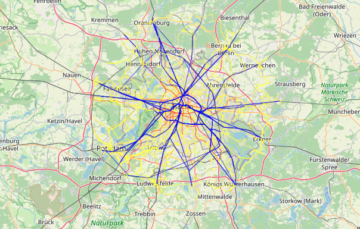

## Edge detection of transportation mode in public transport network

### Data

- extracted_files: folder containing all data of all graphs
- processed_files: folder containing all processed data (final dataset) of all graphs

### Notebooks

- processing_pipeline.ipynb: notebook containing the pipeline to process the data. The output of this notebook is the processed data in the folder processed_files.
- exploration.ipynb: notebook containing data analysis on the network. Information such as most important nodes (hubs), Degree analysis, Class balanceness analysis, and Visualisation of Berlin network (To see the map visualisation in the notebook, go at https://nbviewer.org/github/ogimgio/Network-ML-Project/blob/master/exploration.ipynb).
- colab_base_classification.ipynb: notebook containing edge prediction of transportation mode using traditional handcrafted features, Node2Vec and GNN.
- label_pred_analysis.ipynb: notebook containing analysis of label prediction using traditional handcrafted features, Node2Vec and GNN.

## Report

Available at [report.pdf](report_networkml.pdf)

